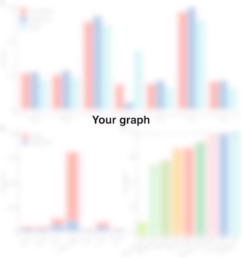

# Unix Course Final Assignment
This is a template repository for the Unix course final assignment. You should use this template to submit your solution to the final assignment.

Put your shell code in `workflow.sh` and the R code to visualise results in `data-analysis.R`.

Here, please, describe the individual steps in your pipeline and the actual results...

```bash
Your code here
```

What is in the graph?



```bash
Your code here
```

What are the results?


